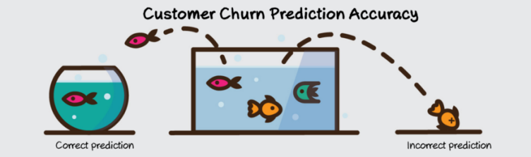
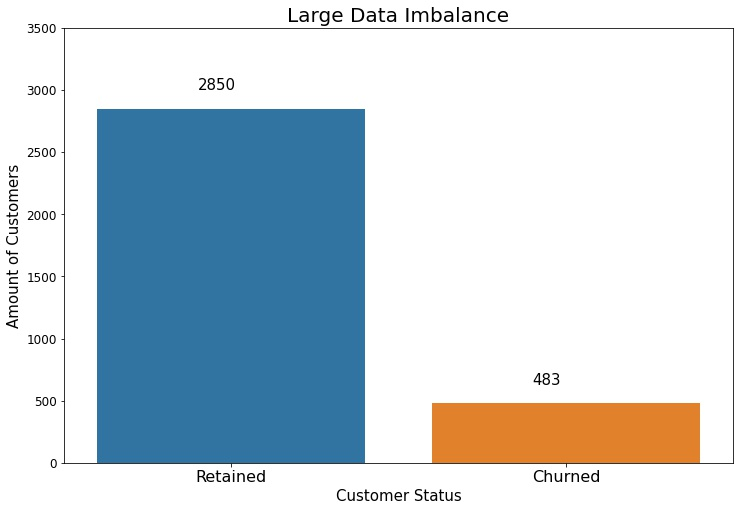
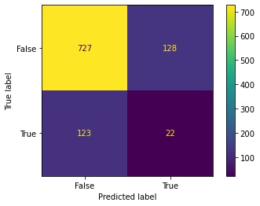
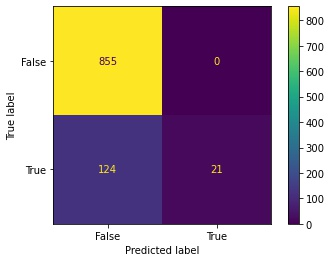
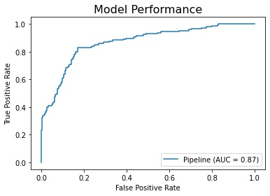
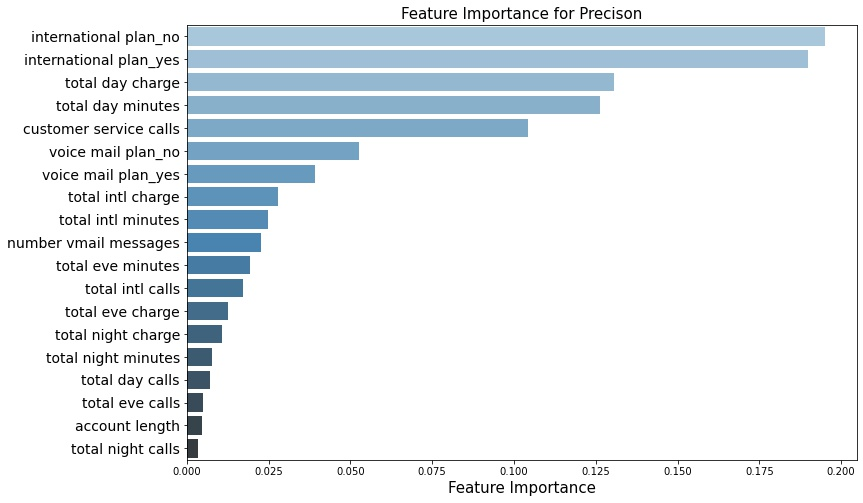

<!-- #region -->


# Predicting Churn for SyriaTel
Building a classifier to predict whether a customer will ("soon") stop doing business with SyriaTel, a telecommunications company.

#### Author: Max Ross
(data used in analysis found @ [Kaggle](https://www.kaggle.com/datasets/becksddf/churn-in-telecoms-dataset))

# Introduction and Business Case:
    
### 1. Business Understanding:
    - Syriatel is a mobile network provider in Syria. It is one of the only two providers in Syria.
    - Mobile network providers' revenue is largely impacted by customers leaving their network, which is oftern referred to as churn.
    - Not only does churn mean lost revenue, it also means your team has to double down on acquiring new customers for those that are lost. Afterall, it can cost up to 5 times as much to acquire a new customer as it does to retain your current ones.
    
### 2. Business Problem:
    - SyriaTel is addressing their churn by trying to predict when customers may churn in advance based on certain charactersistics of their usage. This can be referred to as a 'Targeted' approach to churn. The company then targets those customers with special programs or incentives. This approach can bring in a huge loss for a company, if churn predictions are inaccurate, because then firms are wasting incentive money on customers who would have stayed anyway. There are numerous predictive modeling techniques for predicting customer churn. 
    
### 3. Action Plan:
    - Creating a predictive model optimized for **precision** which is a metric that evaluates the models false positives vs it's true positives.
    - Using this model we will try to uncover important features that have a larger impact on customers churning from SyriaTel so that they can confidently allocate resources in order to retain likely churning customers.
## Data Overview:

#### Categorical Target
- Binary:True/False(bool)
- Yes, 86% non-churned, 14% churned 
- Since we're interested in predicting churn and their are only 3,333 data points I'm going to oversample the minority ('churn'=True) using SMOTE.

#### Features
- Focusing on features that represent a customers usage and their account plan.
- Leaving out location based features for this analysis since they do not directly represent customer usage or account plan.
- No null values, and no duplicates
- Focusing on features that represent a customers usage and their account plan.
- Leaving out location based features for this analysis since they do not directly represent customer usage or account plan.
- All int/float columns measure usage of a customer 
- Numeric columns are in different units (months, calls, minutes, dollars) so normalizing will be necessary
- Category columns define different plans for the user
- Categorical columns are binary and will be onehotencoded in preprocessing



## Methods

#### Cofusion Matrix Breakdown
$\begin{bmatrix}
TN & FP \\
FN & TP
\end{bmatrix}$

tn = customer predicted **no-churn** and it's **true**

fp = customer predicted **churn** and it's **false**

fn = customer predicted **no-churn** and it's **false**

tp = customer predicted **churn** and it's **true**

- Will be evaulating model using **precision** which scores the rate of true positives to false positive.

- Will Be using a dummy_model as our benchmark for performance

#### Dummy Model Confusion Matrix:


## Modeling Results

#### Final Model Confusion Matrix



- Our final model's confusion matrix shows that it correctly identified 855 customers as not churning and had 124 false negatives. Importantly, the model had zero false positives and 21 true positives. This shows that our final model is optimized for precision in identifying customers who will churn.


#### Final Model ROC-AUC Curve



- Compared to the dummy model, our final model performed significantly better in terms of true negatives and false positives. Both models, however, had a similar number of false negatives, indicating room for improvement in future versions of our final model.

#### Final Model Feature Importance



- Our model indicates that SyriTel's international plan has a high indication of whether or not a customer will churn and, if our model is correct, would be an ideal feature to focus customer churn resources for SyriaTel.

- Unfortunately our Final model shows a precision score of 1.0 compared to the training score of .98 which may mean that the model is overfitting to the training data and may not perform well with new data. 


## Conclusions & Recommendations

- Final model is a promising tool for predicting customer churn and informing business decisions regarding resource allocation and retention strategies. 

- However, it is vital to understand the model's limitations and consider additional factors that may influence customer churn. Through continuous improvements and adaptations, we can further enhance the model and increase its positive impact on customer retention efforts.

## Next Steps
- A simpler model may perform better with overfitting and would be the first next step to take for creating an optimized model for precision
- After a simpler model is optimized for precision, we could continue to tweak the model with feature engineering in order to increase recall in order to predict more True Positive cases of churn

## For More Information
See the full analysis in the [Jupyter Notebook](./predicting_churn_analysis.ipynb) or review the [presentation](./predicting_churn_analysis.pdf).

For additional info, contact Max Ross on [LinkedIn](https://www.linkedin.com/in/maxim-ross/) or [email](mailto:maximross55@gmail.com) and find more of his analysis on [GitHub](https://github.com/ImMaxRoss) and [Medium](https://medium.com/@ImMaxRoss)


## Repository Structure
```
├── data
├── images
├── predicting_churn.pdf
├── predicting_churn.ipynb
└── README.md
```
<!-- #endregion -->
